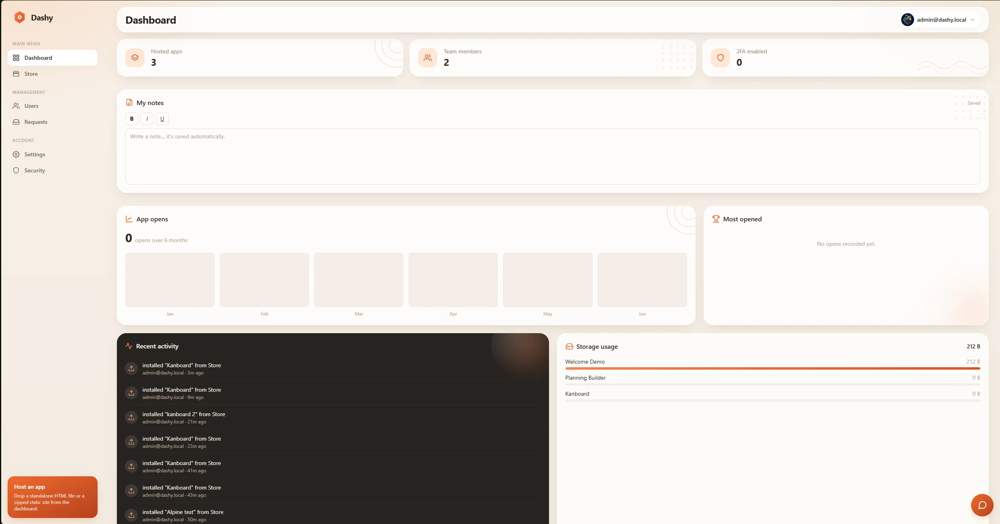

# Dashy

A small, **self-hosted dashboard to host and launch your own web apps** — from
standalone static sites (the single-file HTML artifacts or little static sites
generated by AI) to one-click installs and full **`docker-compose` deployments**
from a built-in **Store**.



Log in (with optional TOTP 2FA), then either **drop in** a `.html` file or a
`.zip` static site, or **install an app from the Store** — a simple tile, a
hosted static bundle, or a `docker-compose` stack. Everything shows as a card on
a responsive grid; click one and it opens in a new tab, served by Dashy itself.

No SaaS, no paid services — everything runs on a single machine.

---

## Features

### 📦 Apps & hosting

- **Import apps** — upload a standalone `.html` (stored as `index.html`) or a `.zip` static site (safely extracted, entry file auto-detected).
- **Preview cards** — responsive grid (1 → 4 columns); upload a preview image or get an auto-generated placeholder.
- **Manage** — rename, edit the description, change the entry file, replace the preview, or delete (removes files from disk).
- **Update & roll back** — re-upload an app's content in place (URL, opens and favorites kept); previous versions are snapshotted for rollback.
- **Organize** — tag apps with a category, filter by it, star favorites, and search the grid.

### 🛍️ Store (admin)

- **Catalogues** — add **sources**: a local JSON file, a remote URL, or a **Dashy-managed catalogue you edit entirely from the UI** (add / edit / remove apps, no JSON to hand-write).
- **Three install types** — **`tile`** (a card linking to a URL); **`static`** (a `.zip`/`.html` downloaded from a URL *or uploaded straight from your computer*, re-hosted by Dashy, with in-place content updates); and **`deploy`** (a `docker-compose` stack).
- **Flexible deploy authoring** — paste the compose, give a **GitHub repo URL**, or just a **Docker Hub image** + port (Dashy generates the compose). Deploys support **persistent volumes**, editable env, and **Redeploy / Restart**.
- **Runtime-detected drivers** — direct **Docker**, **Coolify**, **Portainer**, or a universal **manual** copy/paste. Tokens are encrypted backend-only; uninstalling stops/removes the container and tidies up.

### 👥 Users & access (admin)

- **Multi-user & access control** — create users and choose, per user, which apps each can open; regular users see only their assigned apps.
- **Account types** — **admin** (full control); **semi-admin** who can manage users (rights + passwords), moderate the assistant and handle/relay requests, but has *no* access to the Store, backups, or other staff accounts; and **temporary** accounts created with a lifetime (hours/days) — a dashboard countdown (red under 12 h), no password/2FA, blocked and auto-purged when they expire.
- **User insights & messaging** — click a user for their Dashy history (most-used apps, 2FA status, assistant-misuse flags with a one-click **time-out**), and push a **notification to their dashboard** that they must acknowledge (you get the read receipt).
- **Public share links** — share a hosted app via an unguessable `/share/<token>/` link, with optional password and expiry, to people without an account.
- **Rich dashboard** — open-count tracking, an opens-over-time chart, a "most opened" leaderboard, a recent-activity feed, and per-app storage usage.

### 🤖 AI assistant ("Dashy" bot)

- **In-app chatbot** — explains how Dashy works, recommends the right app (with one-click links), gives step-by-step guidance, and replies in the user's language. Admins pick the provider (**OpenRouter, OpenAI, Deepseek, or an Anthropic model**), model and API key (encrypted at rest), and enable it per user.
- **Project requests** — through the bot, users can request a shared file/site or an idea; admins review them on a **Requests** page and can **reply back** to the requester's dashboard.
- **Admin power-ups** — admins get more technical answers and can ask the assistant to **create a Store catalogue, source or app** — it proposes the action and nothing happens until the admin clicks **Confirm**.

### 🎨 Personalization

- **Personal notes** — a per-user note tile (**bold / italic / underline**), auto-saved server-side so it survives logout and refresh.
- **Per-user settings** — profile (nickname, full name, job title, avatar), interface **language**, **theme**, and date/time preferences.
- **7 languages** — English (default), Français, Español, Deutsch, Italiano, 简体中文, Русский.
- **4 themes** — Light, Dark, Violet, and **Image** (your own background photo with an optional frosted "liquid glass" effect). Warm "ember/sand" palette, subtle animations, mobile-first.

### 🔒 Account & operations

- **Secure auth** — password login (argon2id), JWT in `httpOnly` cookies, optional **TOTP 2FA** with QR setup + single-use backup codes.
- **Session control** — see active sessions (device, IP, last seen), revoke any individually, or "sign out of all devices".
- **Backup & restore** (admin) — download every hosted app (files + metadata) as one `.zip` and restore it on another server.
- **Hardened** — `helmet`, per-route rate limiting, `zod` validation, path-traversal / zip-slip protection, secrets encrypted at rest (TOTP secrets and LLM API keys, AES-256-GCM).
- **One-command deploy** — multi-stage Docker build + `docker-compose`, a single container serving both API and SPA.

---

## Tech stack

| Layer     | Choice                                                            |
| --------- | ---------------------------------------------------------------- |
| Backend   | Node.js 20, Express, TypeScript                                   |
| Database  | MongoDB (Mongoose)                                                |
| Frontend  | React 18, Vite, TypeScript, Tailwind CSS                          |
| Auth      | `jsonwebtoken`, `argon2`, `otplib`, `qrcode`                      |
| Uploads   | `multer`, `adm-zip`                                               |
| Security  | `helmet`, `express-rate-limit`, `zod`, AES-256-GCM, httpOnly cookies |
| Packaging | Docker multi-stage + docker-compose                              |

---

## Project structure

```
Dashy/
├── server/                 # Express + TypeScript API
│   ├── src/
│   │   ├── config/         # env (zod), db, paths
│   │   ├── models/         # User, HostedApp, Store*, Chat*, … (Mongoose)
│   │   ├── middleware/     # auth, upload, rate-limit, validation, errors
│   │   ├── controllers/    # auth, apps, store, chat, … logic
│   │   ├── routes/         # /api/{auth,apps,users,stats,chat,store,notifications,requests}, /hosted, /store-apps
│   │   ├── store/          # Store: manifests, catalog, install, managed catalogues, deploy drivers
│   │   ├── services/       # admin seed, app content, chat prompt/provider, activity
│   │   ├── utils/          # crypto, slug, safe-zip, jwt
│   │   └── index.ts        # entry point
│   └── tests/              # smoke + e2e (mongodb-memory-server)
├── client/                 # React + Vite + Tailwind SPA
│   └── src/                # pages, components, api, contexts
├── Dockerfile              # multi-stage build
├── docker-compose.yml      # app + mongo
└── .env.example
```

In production the client is built into `server/public` and served by Express, so
the whole thing runs as **one container** (plus MongoDB).

---

## Quick start (Docker)

```bash
# 1. Configure
cp .env.example .env
#    then edit .env — at minimum set the secrets and admin credentials (below)

# 2. Build & run
docker compose up -d --build

# 3. Open http://localhost:3000  (or your APP_ORIGIN)
#    Log in with ADMIN_EMAIL / ADMIN_PASSWORD
```

The admin account is **seeded on first start only if the users collection is
empty**. Hosted apps and previews live in the `apps_data` volume; the database
lives in `mongo_data`. Both persist across restarts and redeploys.

### Generate the secrets

```bash
# JWT signing secret
openssl rand -base64 48

# 32-byte encryption key for TOTP secrets (must be 64 hex chars)
openssl rand -hex 32
```

Put these in `.env` as `JWT_SECRET` and `ENCRYPTION_KEY`.

---

## Local development

Runs the API and the Vite dev server separately (the dev server proxies `/api`
and `/hosted` to the backend, keeping cookies same-origin).

You need a MongoDB to point at — either a local install or:

```bash
docker run -d --name dashy-mongo -p 27017:27017 mongo:7
```

Then:

```bash
# Install both workspaces
npm run install:all

# Create server env (the server reads ../.env or its own env)
cp .env.example .env
#   set MONGO_URI=mongodb://localhost:27017/dashy  for local dev

# Terminal 1 — API on :3000
npm run dev:server

# Terminal 2 — SPA on :5173 (proxies to :3000)
npm run dev:client
```

Open <http://localhost:5173>.

---

## Environment variables

| Variable | Required | Default | Accepted values / example | Description |
| --- | :---: | --- | --- | --- |
| `NODE_ENV` | no | `development` | `development` · `production` · `test` | `production` enables `Secure` cookies (use behind HTTPS). |
| `PORT` | no | `3000` | positive int — e.g. `3000`, `8080` | Port the server listens on (inside the container). |
| `APP_ORIGIN` | no | `http://localhost:3000` | a valid URL — e.g. `https://dashy.example.com` | Public origin used for CORS and cookie settings. |
| `MONGO_URI` | **yes** | — | `mongodb://mongo:27017/dashy` | MongoDB connection string (host is the compose service name `mongo`). |
| `JWT_SECRET` | **yes** | — | ≥16 chars — `openssl rand -base64 48` | Secret for signing JWTs. Rotating it logs everyone out. |
| `ENCRYPTION_KEY` | **yes** | — | 64 hex chars — `openssl rand -hex 32` | 32-byte key (AES-256-GCM) encrypting TOTP secrets at rest. |
| `ADMIN_EMAIL` | seed | — | a valid email — e.g. `admin@example.com` | Seed admin email (first run only, empty DB). |
| `ADMIN_PASSWORD` | seed | — | ≥8 chars — e.g. `ChangeMeNow!2026` | Seed admin password (first run only, empty DB). |
| `ALLOW_REGISTRATION` | no | `false` | `true` / `false` (also `1` / `0`) | Enable the `/api/auth/register` endpoint. |
| `MAX_UPLOAD_MB` | no | `50` | positive int — e.g. `50`, `200` | Max size (MB) of an imported app archive/file. |
| `DATA_DIR` | no | `/data` (Docker) · `server/data` (local) | absolute path — e.g. `/data` | Root dir for all persisted files (apps, avatars, catalogs, …). |
| `DOCKER_SOCKET` | no | `/var/run/docker.sock` | an absolute socket path | Host Docker socket for the Store's "direct Docker" driver. |
| `HOST_PORT` | no | `3000` | free host port — e.g. `3000`, `8080` | Host port docker-compose publishes (maps to the container's `PORT`). |

The server **validates its environment on startup and refuses to boot** if a
required value is missing or malformed (e.g. an `ENCRYPTION_KEY` that isn't 64
hex characters, or an `APP_ORIGIN` that isn't a valid URL).

A ready-to-edit template lives in [`.env.example`](.env.example) — copy it to
`.env` and fill in real values:

```bash
cp .env.example .env
# then edit .env: generate JWT_SECRET / ENCRYPTION_KEY and set your admin creds
```

---

## Deploying on Coolify

Dashy ships with a `docker-compose.yml` that runs **two containers together** —
the app and its MongoDB database — and redeploys on every `git push`. Follow
these steps exactly; the most common mistake is picking the wrong resource type.

### Step 1 — Create the resource from your **Git repo** (not from a pasted compose)

In Coolify: **+ New Resource**. Scroll to the **Git Based** section at the top of
the page and choose **Public Repository**.

> ⚠️ Do **not** use the *Docker Compose Empty* option under "Docker Based". That
> one only has the compose file, so it can't build Dashy's `app` image and fails
> with `failed to read dockerfile: open Dockerfile: no such file or directory`.
> Dashy must be built from the repo so Coolify has the `Dockerfile` + source.

- **Repository:** `https://github.com/<you>/Dashy`
- **Branch:** `main`

### Step 2 — Set the Build Pack to **Docker Compose**

After entering the repo, find the **Build Pack** selector and switch it from
**Nixpacks** (the default) to **Docker Compose**. Then set:

- **Docker Compose Location:** `/docker-compose.yml`
- **Base Directory:** `/`

This is the setting that makes everything work — Nixpacks ignores the compose
file and tries to guess how to build, which is not what you want.

### Step 3 — Environment variables

In the **Environment Variables** tab, set at least:

```
APP_ORIGIN=https://dashy.example.com   # your real domain
JWT_SECRET=...                          # openssl rand -base64 48
ENCRYPTION_KEY=...                      # openssl rand -hex 32  (64 hex chars)
ADMIN_EMAIL=admin@example.com
ADMIN_PASSWORD=ChangeMeNow!2026
NODE_ENV=production                     # so session cookies are Secure (HTTPS)
```

`MONGO_URI` is already wired in the compose (`mongodb://mongo:27017/dashy`) — you
don't need to set it. See the [Environment variables](#environment-variables)
table for the full list.

### Step 4 — Persistent storage

The app stores everything (users, uploaded apps, catalogs, avatars…) under
`/data` inside the container. Make sure the volume's **Destination Path is
`/data`** so it survives redeploys — that's the path the image writes to by
default, so you do **not** need a `DATA_DIR` variable. The `mongo_data` volume
keeps your database. Both must be persistent.

### Step 5 — Comment out the Docker socket line

Open `docker-compose.yml` and **comment the socket line** before deploying:

```yaml
    volumes:
      - apps_data:/data
      # - /var/run/docker.sock:/var/run/docker.sock   # ← comment out on Coolify
```

On a shared Coolify host this socket would give Dashy near-root control over the
**whole machine** (every app you host there), so leave it off. To deploy
docker-compose apps from the Store, use the **Coolify** deploy driver instead —
it deploys through Coolify's API and needs no socket (see
[The Store → Deploy drivers](#deploy-drivers)).

### Step 6 — Domain & deploy

Point your domain at the service; Coolify's proxy terminates TLS. Click
**Deploy**. Coolify clones the repo, builds the `app` image, pulls `mongo:7`, and
starts both. Then open your domain and log in with `ADMIN_EMAIL` /
`ADMIN_PASSWORD`. Every later `git push` to `main` redeploys automatically.

---

## The Store (app catalogue)

The **Store** (admin-only) turns Dashy into a one-click app catalogue. You add
decentralised **sources**, Dashy reads app **manifests** from them, and
installing an app drops a card onto the dashboard like any other hosted app.

### How it works

1. **Add a source** — in *Settings → Store* add one or more catalogue sources:
   - `local` — a JSON file or folder on the server.
   - `remote` — a URL (e.g. a raw JSON file on GitHub).
   - **managed** — click *Create* under **Managed catalogue**: you give it a
     name and Dashy creates and owns a catalogue file (under the data volume), so
     you can **add / edit / remove apps from the UI** — no JSON to write by hand.
     You *create* managed catalogues here in Settings, but you **manage their
     apps from the Store page** (*Store → Manage catalogues → Manage apps*).

   Each source has a refresh TTL (cached in the DB, 60 min by default) and an
   on/off switch. The `/store` page merges every enabled source and tags each
   app with where it came from. Hit **Refresh** to re-fetch immediately.

2. **Browse & install** — open **Store** in the menu, search the catalogue, and
   click an app to open the install modal. What happens next depends on the
   app's **type** (see below).

3. **It becomes a card** — every install creates a normal dashboard card
   (category `Store`) plus a tracked record so you can **Update** or
   **Uninstall** it later from the *Installed* list. Uninstalling removes the
   card, deletes any on-disk files, and cleans up favorites/assignments.

### Manifest format

Each app is described by a standalone JSON **manifest**, validated on ingestion
(invalid manifests are skipped, valid ones still load). A source is either a
bare array of manifests or an index object `{ "apps": [ … ] }`. A `local`
folder source may also hold **one `.json` file per app** — Dashy reads every
`*.json` in the folder and merges them. A ready-to-use sample catalogue (a
**Welcome Demo** card plus `static`/`deploy` templates) ships at
[`docs/store-catalog.example.json`](docs/store-catalog.example.json) — point a
`local` source at it, or host it somewhere and add it as a `remote` source.

```jsonc
{
  "id": "my-app",            // lowercase slug [a-z0-9-]
  "name": "My App",
  "description": "What it does",
  "icon": "https://…/icon.png",
  "version": "1.0.0",
  "type": "tile",            // "tile" | "static" | "deploy"

  // exactly one block, matching "type":
  "tile":   { "url": "https://example.com" },
  // static: a remote URL, or an uploaded bundle ref (managed catalogues only)
  "static": { "source_url": "https://…/site.zip", "entrypoint": "index.html" },
  // "static": { "upload": "store-upload:<token>", "entrypoint": "index.html" },
  "deploy": {
    "docker_compose": "services:\n  app:\n    image: …",
    "required_env": [{ "key": "API_KEY", "label": "API key", "secret": true }],
    "volumes": [{ "name": "app-data", "mountPath": "/data" }],
    "default_port": 8080
  }
}
```

### Install types

- **`tile`** — just a card linking to an external `url`. Nothing is downloaded.
- **`static`** — the content comes from either a `source_url` Dashy downloads
  **or**, in a managed catalogue, a `.html`/`.zip` you **upload straight from
  your computer** (no hosting needed). A `.zip` is safely extracted, a single
  file is stored as the entrypoint, into the `apps_data` volume under
  `store-apps/<slug>/`, then served either at a **path** (`/store-apps/<slug>/`)
  or, if you've enabled **wildcard DNS**, on a dedicated **subdomain**
  (`<slug>.<your-domain>`). Can be updated in place.
- **`deploy`** — shows the `docker-compose` **preview** and any required env
  vars, you pick a **driver**, it deploys the stack, and you give the resulting
  **URL** that the card will point to. When authoring a deploy app in a managed
  catalogue you can supply the compose three ways: **paste** it, give a **GitHub
  repo URL** (Dashy fetches the compose — the repo only needs a
  **`docker-compose.yml`**, or `compose.yaml` / `docker-compose.yaml` /
  `compose.yml`, at its **root** on the default branch `main`/`master`), or just
  give a **Docker Hub image** name + port and Dashy **generates** a minimal
  compose for it. The result stays editable before you save, and the deploy block
  can declare persistent **`volumes`**.

### Deploy drivers

Drivers are capability-detected — only the ones usable on your host are offered:

| Driver        | When it's available            | What it does                                   |
| ------------- | ------------------------------ | ---------------------------------------------- |
| **Docker**    | Docker socket reachable        | runs `docker compose up` for the stack         |
| **Coolify**   | configured in Store settings   | `POST /api/applications/dockercompose`         |
| **Portainer** | configured in Store settings   | `POST /api/stacks`                             |
| **Manual**    | always                         | gives you the compose to run yourself          |

Driver credentials (Coolify token, Portainer key) are configured in
*Settings → Store*, **encrypted at rest (AES-256-GCM)**, never returned to the
browser, and never read from a manifest. A deploy always shows the compose
preview first and always asks for the final app URL before creating the card.

For the **direct Docker** driver, Dashy must reach the host's Docker engine: it
runs `docker compose`, so it needs both the Docker **socket** and the **docker
CLI** (the image already ships the CLI + compose plugin). It only ever talks to
the **local** Docker engine of the host Dashy runs on (a Unix socket, not a
network connection) — apps you deploy this way run on that same host.

#### Enabling it when Dashy itself runs in a container

If Dashy runs **inside a container** (the normal Docker / Coolify deployment) it
**cannot see the host's Docker by default** — you must share the host's Docker
socket into the container as a volume, mapping it to the **same path inside
Dashy**:

| Source (on the host)   | Destination (inside the Dashy container) |
| ---------------------- | ---------------------------------------- |
| `/var/run/docker.sock` | `/var/run/docker.sock`                   |

- With **docker-compose**, it's already wired up: the provided
  `docker-compose.yml` mounts `- /var/run/docker.sock:/var/run/docker.sock`.
  Comment that line out to disable Docker deploys.
- With **Coolify** (or any UI that asks for a volume / bind mount), add one with
  **source** `/var/run/docker.sock` and **destination / mount path**
  `/var/run/docker.sock`.

Dashy's entrypoint then auto-joins the socket's group at startup (its GID differs
per host — `0` on Docker Desktop, the `docker` group on a typical Linux host), so
no manual permission tweak is needed.

⚠️ Mounting the socket gives the container **near-root control of the host's
Docker**, so enable it only on a trusted, single-admin host. *Settings → Store*
shows a live diagnostic — whether Dashy is containerized and whether the socket
and CLI are present — and warns you, with the exact line to add, when Docker
deploys can't work. Docker deploys can declare **persistent named volumes** and
be **redeployed** or **restarted** from the installed list. The install dialog
prefills the resulting URL with the published host port from the compose.
**Uninstalling** a deploy app stops and removes its container (named volumes are
kept). For an app that came from a **managed catalogue**, uninstalling also
removes it from that catalogue — and drops its Docker image (best-effort, skipped
while the image is still in use) — so its name is free to reuse for a fresh
install. (Apps from read-only `local`/`remote` catalogues stay in the catalogue
after uninstall, so you can simply re-install them.)

---

## Mobile API

A dedicated, versioned API under **`/api/mobile/v1`** lets a companion app (e.g.
*Dashy Mobile*) talk to a remote Dashy instance. It is **Bearer-token** based so
it works for native clients that can't use the dashboard's `httpOnly` cookie.

### Auth flow

1. `GET /api/mobile/v1/info` — public; validate a server URL and read the API
   version + enabled features before showing a login screen.
2. `POST /api/mobile/v1/auth/login` `{ email, password, device? }`
   - no 2FA → `{ token, user }`
   - 2FA on → `{ twoFactorRequired: true, pendingToken }`, then
     `POST /api/mobile/v1/auth/2fa/verify` `{ pendingToken, token }` → `{ token, user }`
3. Send the access token on every call: `Authorization: Bearer <token>`.

The token is the same revocable, per-device JWT the web app uses, so the session
appears under the user's active sessions (labelled with `device`) and can be
revoked from any client. `POST /auth/logout` revokes the current device.

### Endpoints

| Method & path | Who | Purpose |
| --- | --- | --- |
| `GET /info` | public | Server name, API version, features |
| `POST /auth/login` · `/auth/2fa/verify` · `/auth/logout` | — / token | Bearer login + 2FA + logout |
| `GET /auth/me` · `/auth/sessions` · `DELETE /auth/sessions/:id` | user | Profile + device management |
| `GET /sync` | user | **One-call snapshot** to hydrate the app |
| `GET /apps` · `GET /apps/:id` · `POST /apps/:id/favorite` | user | Accessible apps + favorites |
| `GET /notifications` · `POST /notifications/:id/read` | user | Dashboard notifications |
| `GET /requests` · `POST /requests` | user | Project requests |
| `GET /chat/status` · `POST /chat` | user | Dashy AI assistant (non-streaming) |
| `PATCH /profile` · `GET/PUT /note` | user | Preferences + personal note |
| `GET /store/installed` · `/store/catalog` · `/store/config` | admin | Store catalogues + installs |
| `GET /stats/overview` | admin | Analytics |

`GET /sync` returns `user`, `apps`, `favorites`, `note`, unread `notifications`
and the user's `requests`; staff additionally receive an `admin` block (Store
installs + headline stats). App previews and avatars are served by the existing
`previewUrl` / avatar endpoints — fetch them with the same Bearer header.

> CORS: `/api/mobile/*` accepts any origin without credentials (Bearer tokens
> carry no CSRF risk); the cookie-based dashboard stays locked to `APP_ORIGIN`.
> v1 is read + light actions (incl. the AI assistant) — uploads, installs and
> deploys remain web-only.

---

## Security notes

- **Passwords** are hashed with argon2id; plaintext is never stored or logged.
- **Sessions** use a signed JWT in an `httpOnly`, `SameSite=Strict` cookie
  (`Secure` in production). There is a separate short-lived *pending* token that
  can only complete the 2FA step — it cannot access any protected resource.
- **TOTP secrets** are encrypted at rest (AES-256-GCM); **backup codes** are
  argon2-hashed and single-use.
- **Uploads** are limited by size and extension allow-list; ZIP extraction
  rejects absolute paths and `..` traversal (zip-slip) and verifies every entry
  resolves inside the app directory. Hosted file serving applies the same
  traversal checks.
- **Hosted apps are private and access-controlled**: `/hosted/<slug>/` requires
  an authenticated session **and** that the user is allowed to open that app
  (admins may open everything; regular users only their assigned apps). The same
  check applies to the app detail and preview endpoints. The dashboard runs under
  a strict Content-Security-Policy; that CSP is intentionally *not* applied to
  `/hosted` so imported apps can run their own scripts.
- **User management** (`/api/users`) is admin-only, with safeguards against
  deleting your own account or removing the last administrator.
- ⚠️ **Same-origin caveat:** imported apps are served from the same origin as the
  dashboard. Only import content you trust (this is an admin-only action). For
  stronger isolation in a multi-user setup, serve `/hosted` from a separate
  subdomain via your reverse proxy.

---

## Testing

The backend ships with three suites (no Docker needed — they use an ephemeral
in-memory MongoDB):

```bash
npm --prefix server test           # smoke: crypto, slug, safe-zip
npm --prefix server run test:e2e    # full flow: auth, 2FA, import, hosted serving
npm --prefix server run test:mobile # mobile API: Bearer login, 2FA, /sync, favorites
```

---

## License

MIT
